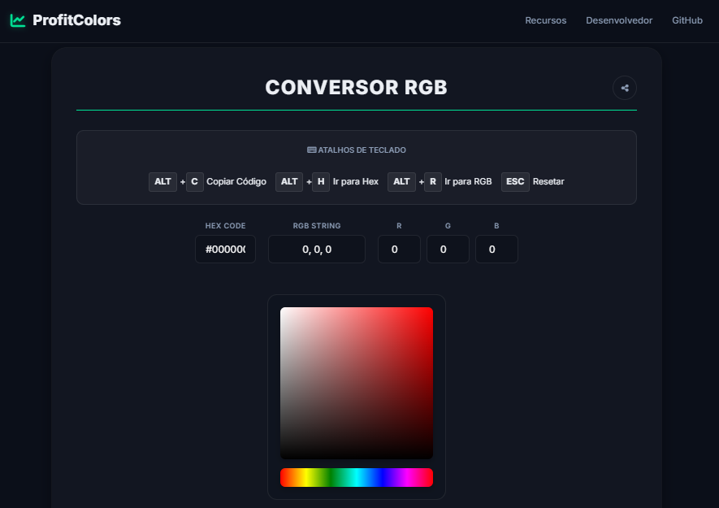

# 🎨 ProfitChart Color Converter


Uma ferramenta web profissional, open-source e gratuita para converter cores (RGB e Hex) para o formato numérico utilizado pela plataforma de trading **ProfitChart** (Nelogica).

🔗 **[Acesse a versão online](https://rkvasne.github.io/profit-colors/app.html)**

Versão atual: **v0.1.3**

---

## 📸 Preview

<div align="center">
  
  <p><em>Interface moderna, responsiva e com suporte a tema escuro.</em></p>
</div>

## ✨ Funcionalidades

### 🔄 Conversão Inteligente
- **RGB ↔ ProfitChart:** Digite valores R, G, B e obtenha o código instantaneamente.
- **Hex ↔ ProfitChart:** Cole códigos Hex (ex: `#7159c1`) e converta automaticamente.
- **Bidirecional:** Altere qualquer campo e todos os outros se atualizam.

### 🎨 Ferramentas Visuais
- **Color Picker:** Seletor visual de matiz e saturação.
- **Histórico:** Salva automaticamente as últimas 12 cores copiadas (persistente no navegador).
- **Tabelas de Referência:** Blocos de cores organizados por matiz (Hue) e escala de cinza.

### ⚡ Produtividade
- **Cópia Rápida:** Clique no resultado ou no botão de copiar para copiar o código Profit.
- **Atalhos de Teclado:**
  - `Alt + C`: Copiar código Profit da cor atual.
  - `Alt + H`: Focar o campo Hex.
  - `Alt + R`: Focar o campo R.
  - `Alt + G`: Focar o campo G.
  - `Alt + B`: Focar o campo B.
  - `Esc`: Resetar foco/fechar ajuda.
- **Compartilhamento:** Botão de compartilhar copia o link da página (ou abre o compartilhamento nativo).

## 🚀 Como Usar

### Versão Online (Recomendado)
Acesse **[rkvasne.github.io/profit-colors/app.html](https://rkvasne.github.io/profit-colors/app.html)** e comece a usar agora mesmo.

Outros links úteis:
- Repositório: **https://github.com/rkvasne/profit-colors**
- Landing page: **https://rkvasne.github.io/profit-colors/**

### Versão Local (Offline)
Como o projeto é um site estático (HTML/CSS/JS), você pode rodá-lo sem instalar nada:

1. Baixe o repositório.
2. Abra `app.html` no navegador (Chrome, Edge, Firefox).
3. Opcional: `index.html` é a landing page.

## 🧮 A Matemática por trás

O ProfitChart utiliza um formato de cor **Inteiro (Integer)** calculado da seguinte forma:

```javascript
// Fórmula de conversão
ProfitCode = Red + (Green * 256) + (Blue * 65536)
```

Onde **R, G e B** são valores inteiros entre `0` e `255`.

## 🤝 Como Contribuir

Contribuições são muito bem-vindas!

- Guia: `CONTRIBUTING.md`
- Código de conduta: `CODE_OF_CONDUCT.md`
- Política de segurança: `SECURITY.md`
- Issues: https://github.com/rkvasne/profit-colors/issues

## 👤 Autor

**Raphael Kvasne**
*Full Stack Developer & Trader*

Especialista em criar ferramentas que unem produtividade e design. Criador do **ProfitColors**, **Dahora App** e **Taskvasne**.

- 🌐 Website: [kvasne.com](https://kvasne.com)
- 💼 LinkedIn: [Raphael Kvasne](https://www.linkedin.com/in/raphael-kvasne/)
- 📸 Instagram: [@rkvasne](https://www.instagram.com/rkvasne/)
- � GitHub: [@rkvasne](https://github.com/rkvasne)
- 📧 Email: rkvasne@gmail.com

## 📝 Changelog

### v0.1.3 (2025-12-28)
- **UI/UX:**
  - Adicionado efeito de animação de "candle" e borda dinâmica nos cards da landing page.
  - Melhorada a visibilidade dos títulos com gradientes animados.
  - Otimizado layout dos inputs numéricos (remoção de setas padrão).
- **Segurança:**
  - Adicionado `rel="noopener noreferrer"` em todos os links externos.
  - Implementado SRI (Subresource Integrity) para recursos de CDN.
  - Removido uso de `innerHTML` em favor de métodos seguros de manipulação do DOM.
- **Documentação:**
  - Unificação e padronização dos arquivos de documentação.

### v0.1.2 (2025-12-26)
- Padroniza os blocos de cores (Profit e Hue) em 12 colunas e múltiplos de 12.
- Atualiza links e corrige a imagem da seção Preview.
- Ajusta instruções e referências para refletir o estado atual do projeto.

---

<p align="center">
  <small>Este projeto não possui afiliação oficial com a Nelogica ou a plataforma ProfitChart.</small>
</p>
